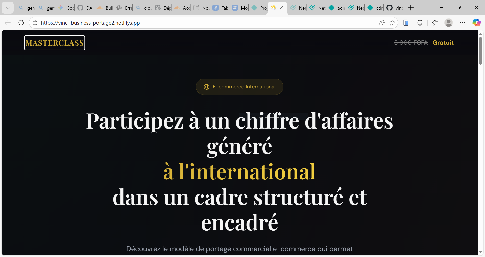
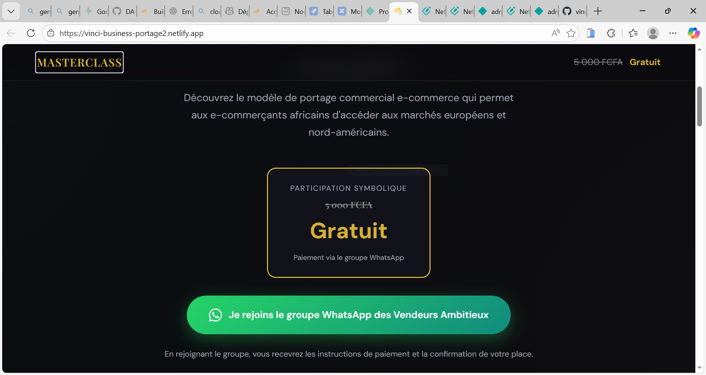
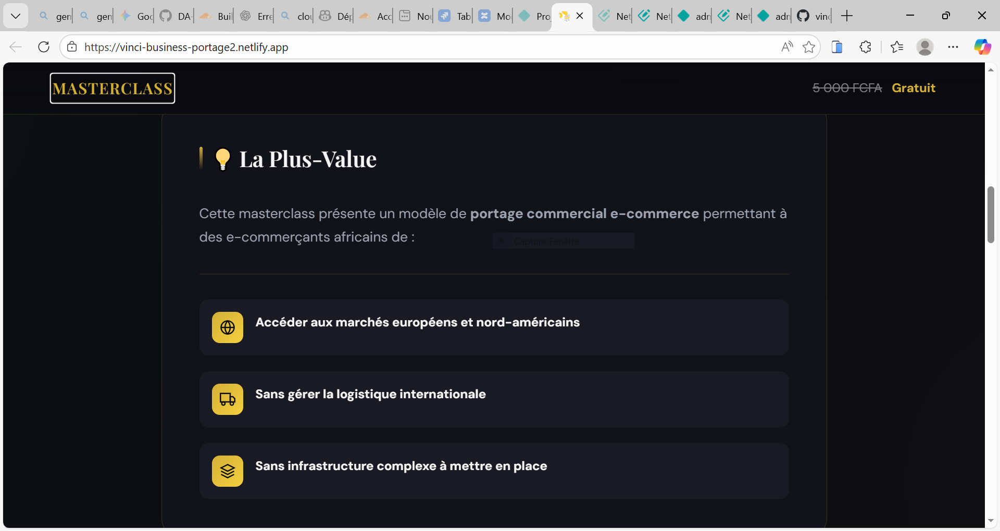
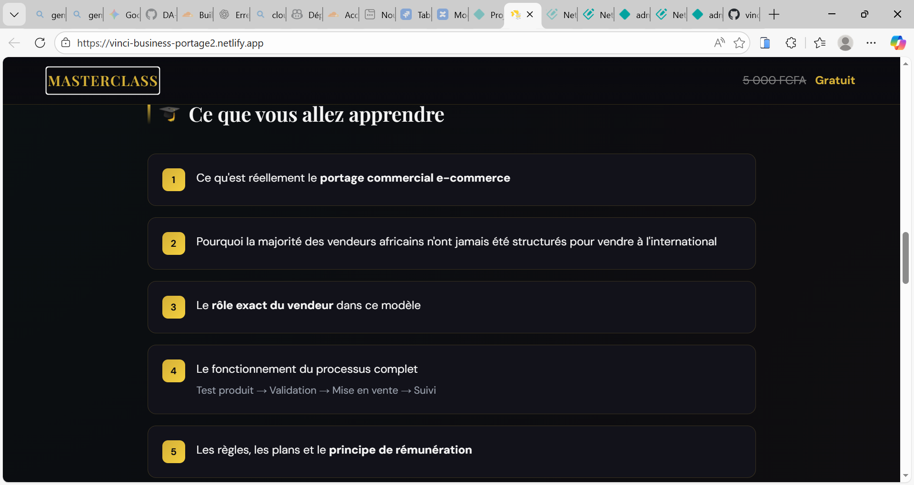
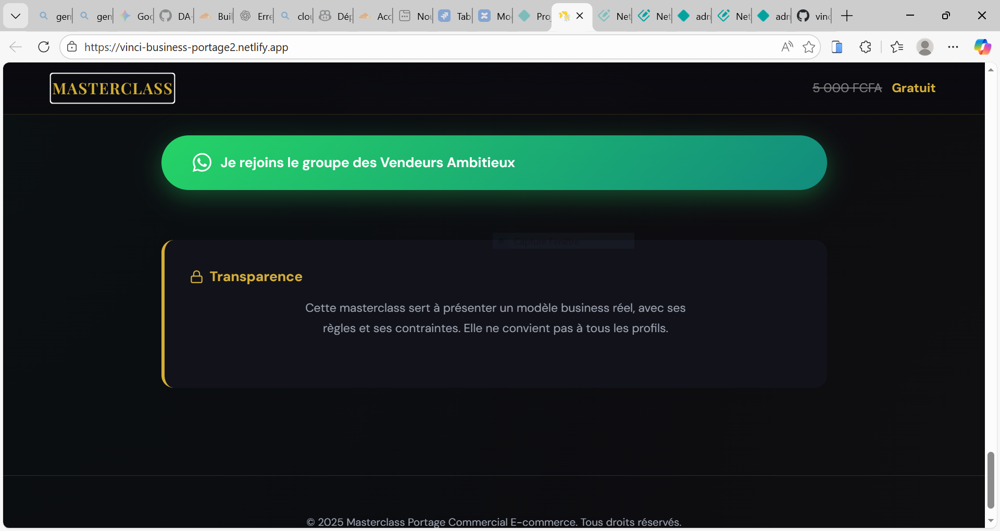
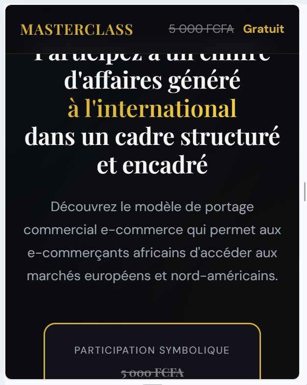
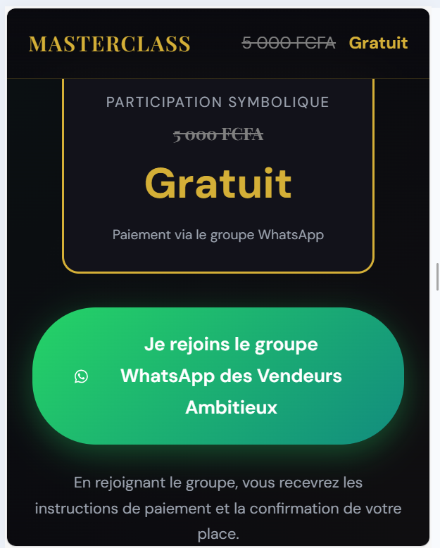
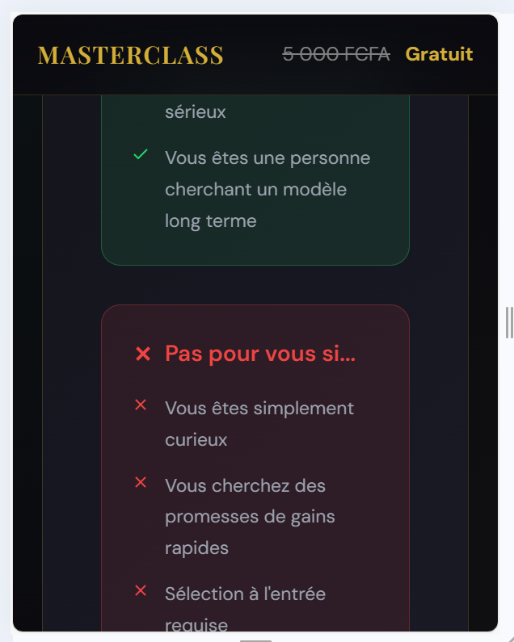
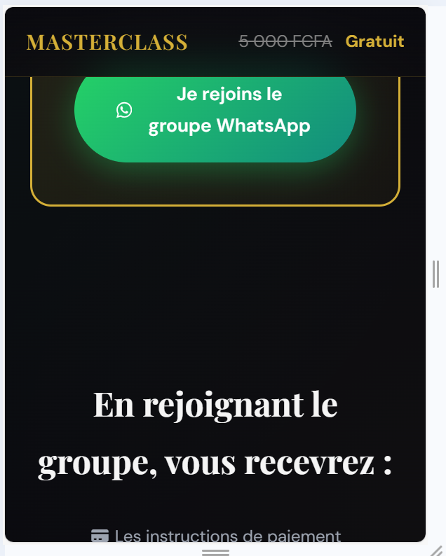

# vinci-business-portage
Frontend d’une landing page pour MasterClass : HTML, CSS, JS, responsive design, avec CTA vers le groupe WhatsApp

**URL du site** :  
[https://vinci-business-portage2.netlify.app/](https://vinci-business-portage2.netlify.app/)

## Informations du projet

- **Projet** : MasterClass Landing Page   
- **Version** : 1.0.0  
- **Dernière mise à jour** : 21 janvier 2026  
- **Hébergement** : Netlify  

## Technologies utilisées
- HTML
- CSS
- JavaScript

## Fonctionnalités
- Landing page moderne et responsive
- Call To Action vers WhatsApp (CTA)
- Animations CSS 
- Compatible mobile, tablette et desktop

## Captures d’écran

### Version desktop

### Version mobile

